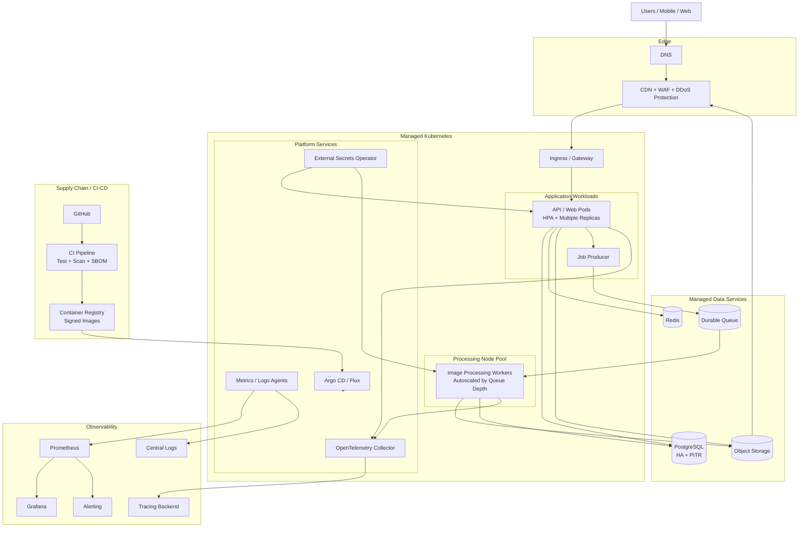
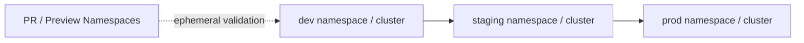

# HDK.io Infrastructure Architecture

## Environment isolation

Production uses isolated credentials, data services, buckets, secrets, and deployment controls. Review environments never receive production credentials or production data.
